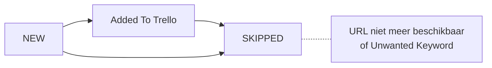
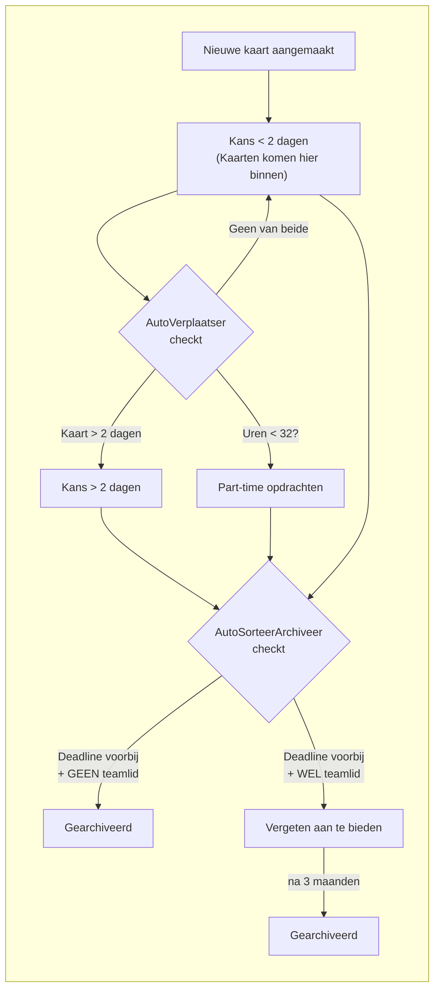
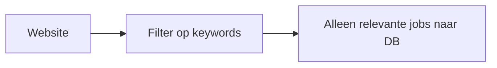
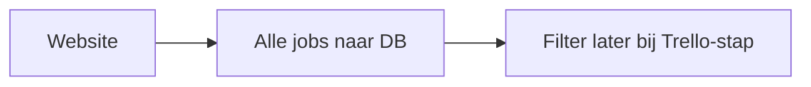
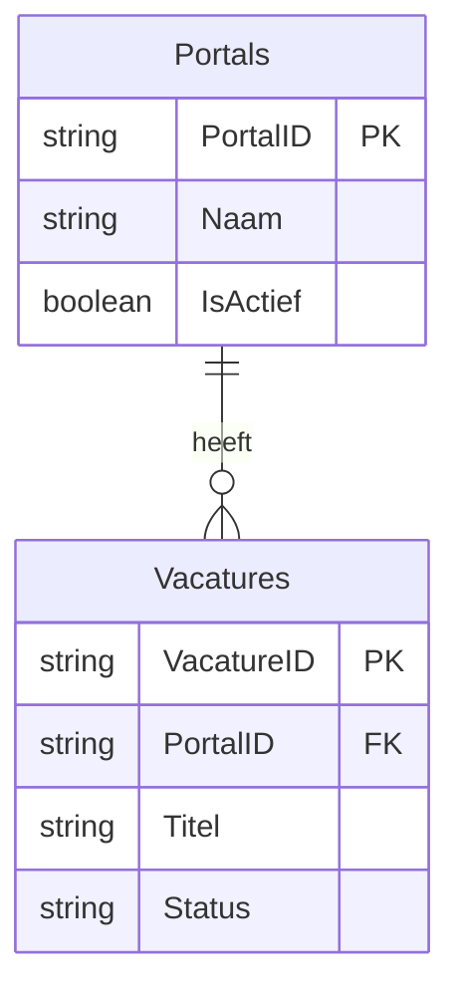
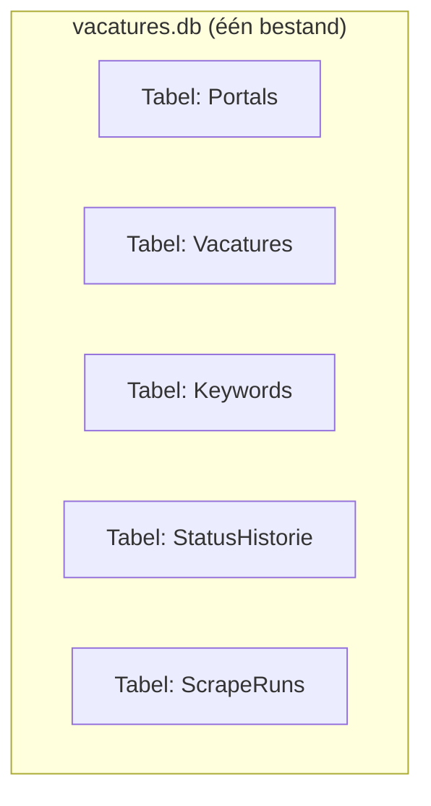
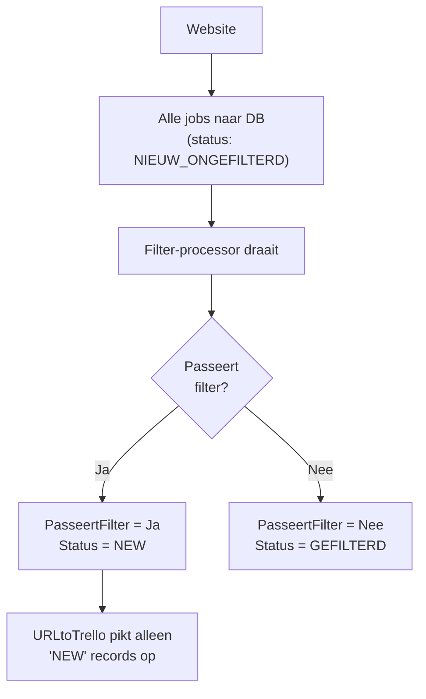
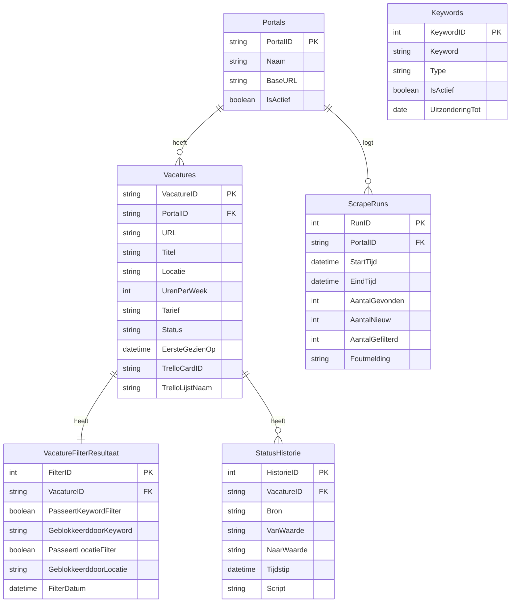
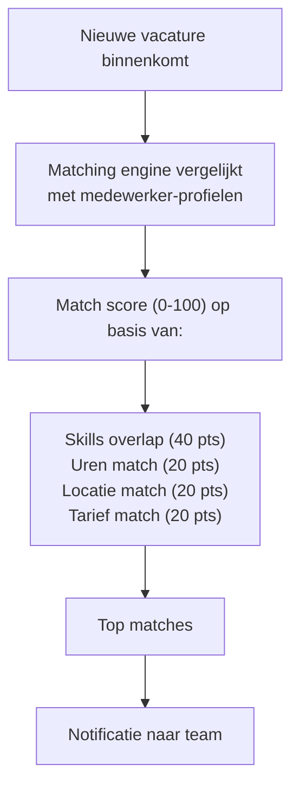

# Database Ontwerp Voorstel: Migratie naar UiPath

**Document versie:** 3.1
**Datum:** 28 januari 2026
**Doelgroep:** Consultants, Product Owners, Business Stakeholders

---

## 1. Introductie

Dit document beschrijft een voorstel voor een nieuwe database-architectuur ter ondersteuning van de migratie van ons web-scraping platform van Python/Azure Functions naar UiPath.

### Wat lossen we op?

| Probleem | Impact |
|----------|--------|
| Credentials staan hardcoded in 30+ Python-bestanden | Beveiligingsrisico |
| Geen audit trail | Troubleshooting lastig |
| Inconsistent filtering-beleid | Sommige scrapers filteren voordat data is opgeslagen in DB, anderen niet |
| Geen inzicht in Trello-kaart lifecycle | Geen diepere analyse mogelijk (ook nog geen vraag naar) |
| Keyword uitzonderingen niet flexibel | Tijdelijke toelating van keywords omslachtig |

### Wat willen we bereiken?

- Eén consistent beleid voor data-opslag
- Mogelijkheid tot toekomstige analyse (ook behoeften die we nu nog niet kennen)
- Flexibel keyword management met tijdelijke uitzonderingen
- Inzicht in wat er met Trello-kaarten gebeurt na aanmaak

---

## 2. Huidige Situatie

### Portals en Scripts

We hebben **15 portals** die elk doorgaans 2 scripts hebben:
- **URLscrape**: Haalt vacature-URLs op van de website en slaat deze op in Azure Cosmos DB
- **URLtoTrello**: Haalt nieuwe vacatures op vanuit Azure Cosmos DB, scrapet de opdracht en maakt Trello-kaarten

Daarnaast zijn er helper-scripts:
- **AutoSorteerArchiveer**: Sorteert kaarten op deadline, archiveert verlopen kaarten zonder teamleden
- **AutoVerplaatser**: Verplaatst kaarten ouder dan 2 dagen naar andere lijst, part-time opdrachten (<32 uur) naar aparte lijst

### Huidige Database

- **Cosmos DB** (NoSQL) met database "ToDoList"
- Container `BB`: Alle vacatures (partition key = portal ID)
- Container `Items`: Ongewenste keywords (~230 trefwoorden)

### Status Flow van een Vacature in de Database



### Huidige Trello Workflow (gebaseerd op code-analyse)

Na aanmaak van een kaart doorloopt deze het volgende pad. De bewegingen worden uitgevoerd door twee automatische scripts.



**Toelichting:**
- **Teamlid**: Een consultant die door een BUM de kaart is toegewezen om aangeboden te worden
- **"Vergeten aan te bieden"**: Kaarten waar wel iemand op zat, maar waar de deadline is verstreken. Worden soms nog opgepakt afhankelijk van of de portal-deadline al voorbij is

**Wat we NIET weten (geen logging):**
- Hoe lang staat een kaart gemiddeld in "Kans < 2 dagen" voordat er actie op komt?
- Welke portals leveren de meeste succesvolle plaatsingen op?
- Hoeveel kaarten eindigen uiteindelijk in "Gearchiveerd" vs daadwerkelijk aangeboden?

### Huidig Inconsistent Filtering-beleid

**Patroon A - Filteren vóór opslag (bijv. Striive, Mercell)**



**Patroon B - Alles opslaan (bijv. Circle8)**



Dit maakt analyse over de algehele 'inhuurmarkt' lastiger: bij patroon A weten we niet hoeveel jobs we missen door filtering.

---

## 3. SQL vs NoSQL: Wat is het verschil?

### SQL (Relationele Database)

**Wat is het?**
Een database met vaste tabellen en kolommen. Data wordt opgeslagen in rijen en kolommen met strikte regels over welke data waar mag staan.

**Voorbeelden:** PostgreSQL, MySQL, SQL Server, SQLite

| Voordelen | Nadelen |
|-----------|---------|
| Strikte structuur voorkomt fouten | Structuur wijzigen vergt migratie |
| Krachtige queries over meerdere tabellen | Minder flexibel bij wisselende data |
| Gratis opties beschikbaar | - |

### NoSQL (Document Database)

**Wat is het?**
Een database die data opslaat als "documenten" (vergelijkbaar met JSON). Elk document kan een andere structuur hebben.

**Voorbeelden:** Cosmos DB (huidige situatie), MongoDB

| Voordelen | Nadelen |
|-----------|---------|
| Flexibel: elk record kan andere velden hebben | Minder geschikt voor complexe relaties |
| Goed voor ongestructureerde data | JOINs tussen tabellen lastiger |
| Schaalt makkelijk horizontaal | Meestal cloud-based (kosten) |

### Waarom willen we relaties tussen tabellen?

Met relaties kunnen we vragen beantwoorden die meerdere "dingen" combineren:

| Vraag | Benodigde relatie |
|-------|-------------------|
| "Hoeveel vacatures heeft Circle8 deze maand opgeleverd?" | Vacatures ↔ Portals |
| "Welke vacatures zijn naar Trello gegaan maar nooit aangeboden?" | Vacatures ↔ Trello Status Historie |
| "Op welk keyword worden de meeste jobs gefilterd?" | Vacatures ↔ Keywords |
| "Hoe lang duurt het gemiddeld voordat een kaart van 'Kans<2d' naar 'Aangeboden' gaat?" | Status Historie analyse |

**Zonder relaties** moet je dit handmatig uitzoeken of aparte exports maken en in Excel combineren.

**Met relaties** schrijf je één query en krijg je direct antwoord:
```sql
SELECT Portals.Naam, COUNT(*) as AantalVacatures
FROM Vacatures
JOIN Portals ON Vacatures.PortalID = Portals.PortalID
WHERE Vacatures.EersteGezienOp > '2026-01-01'
GROUP BY Portals.Naam
```

**Aanbeveling: SQL-database**, specifiek **SQLite** of **PostgreSQL**.

---

## 4. Database Basics: Tabellen, Primary Keys en Relaties

Voordat we het datamodel bespreken, een korte uitleg van de bouwstenen.

### Wat is een tabel?

Een tabel is zoals een Excel-sheet: rijen en kolommen. Elke rij is één record (bijv. één vacature), elke kolom is een eigenschap (bijv. Titel, Locatie).

**TABEL: Vacatures**

| VacatureID | Titel | PortalID | Status |
|------------|-------|----------|--------|
| VAC-001 | Senior Developer | C8 | NEW |
| VAC-002 | Projectmanager | MAGNIT | ADDED_TO_TRELLO |
| VAC-003 | Scrum Master | C8 | SKIPPED |

### Wat is een Primary Key (PK)?

De **Primary Key** is de unieke identifier van elke rij. Geen twee rijen mogen dezelfde PK hebben.

**TABEL: Portals**

| PortalID (PK) | Naam | IsActief |
|---------------|------|----------|
| C8 | Circle8 | Ja |
| MAGNIT | Magnit | Ja |
| STRIIVE | Striive | Ja |

*Elke waarde in de PK-kolom is UNIEK*

### Wat is een Foreign Key (FK)?

Een **Foreign Key** is een verwijzing naar de Primary Key van een andere tabel. Dit creëert de relatie.



**Voorbeeld data:**

**Portals:**

| PortalID | Naam |
|----------|------|
| C8 | Circle8 |
| MAGNIT | Magnit |

**Vacatures:**

| VacatureID | PortalID | Titel |
|------------|----------|-------|
| VAC-001 | C8 | Developer |
| VAC-003 | C8 | Scrum Mstr |
| VAC-002 | MAGNIT | PM |

### SQLite: Eén bestand, meerdere tabellen

**SQLite ondersteunt meerdere tabellen.** Eén `.db` bestand bevat al je tabellen:



---

## 5. Keuze 1: Wat slaan we op bij het scrapen?

### Optie A: Alleen gefilterde vacatures opslaan

```
Website → Filter → Relevante jobs naar DB
```

| Voordelen | Nadelen |
|-----------|---------|
| Kleinere database | Geen inzicht in wat we missen |
| Minder ruis | Geen mogelijkheid om filters achteraf aan te passen |

### Optie B: Alles opslaan met filter-markering

```
Website → Alle jobs naar DB (met veld "PasseertFilter": ja/nee)
```

| Voordelen | Nadelen |
|-----------|---------|
| Volledige dataset voor analyse | Grotere database |
| Filters achteraf aanpasbaar | Iets meer opslag nodig |

### Optie C: Alles opslaan, aparte processor filtert



| Voordelen | Nadelen |
|-----------|---------|
| Scheiding van verantwoordelijkheden | Extra processtap |
| Filter-logica op één plek | Iets complexer |
| Makkelijker te testen | - |
| Alle data beschikbaar voor analyse | - |

**Aanbeveling: Optie C**. De filter-logica staat dan op één centrale plek in plaats van verspreid over 15 scrapers.

---

## 6. Keuze 2: Hoe gaan we om met wijzigingen?

Vacatures wijzigen niet na scraping - we scrapen dezelfde URL niet opnieuw. Maar de **status** wijzigt wel, en in Trello verandert er veel.

### Optie A: Alleen huidige status bewaren

| Voordelen | Nadelen |
|-----------|---------|
| Simpel | **Geen historie** - analyse onmogelijk |

### Optie B: Historie bijhouden

| Voordelen | Nadelen |
|-----------|---------|
| Volledige audit trail | Meer opslag |
| Analyse mogelijk | Iets complexere queries |

**Aanbeveling: Optie B**

---

## 7. Keuze 3: Hoe volgen we Trello-kaart bewegingen?

Trello stuurt niet automatisch een bericht als een kaart verplaatst wordt. We moeten zelf de status ophalen.

### Optie A: Snapshot bij elke scrape-run

Elke keer als de scrapers draaien (elk uur), ook de Trello-status van alle kaarten ophalen.

| Voordelen | Nadelen |
|-----------|---------|
| Regelmatige updates | Veel API-calls naar Trello |
| Goede granulariteit | Kan trager worden bij veel kaarten |

### Optie B: Dagelijkse snapshot

Eenmaal per dag (bijv. 's nachts) alle Trello-kaarten ophalen en status vastleggen.

| Voordelen | Nadelen |
|-----------|---------|
| Minder API-calls | Minder nauwkeurige tijdstippen |
| Eenvoudiger | Weet niet exact wanneer verplaatsing gebeurde |

### Optie C: Alleen eigen acties loggen

Alleen loggen wanneer ONZE scripts iets doen (AutoVerplaatser, AutoSorteerArchiveer). Handmatige verplaatsingen worden niet gelogd.

| Voordelen | Nadelen |
|-----------|---------|
| Minimale overhead | Handmatige acties niet zichtbaar |
| Zeker van bron | Incompleet beeld |

### Optie D: Trello Webhooks (geavanceerd)

Trello kan een bericht sturen naar onze server bij elke wijziging.

| Voordelen | Nadelen |
|-----------|---------|
| Real-time updates | Vereist een server die altijd draait |
| Alles wordt gelogd | Complexere setup |

**Aanbeveling:** Start met **Optie A**. Dit is eenvoudig en geeft al waardevolle inzichten. 

---

## 8. Keuze 4: Database Platform

### Optie A: SQLite (lokaal bestand)

| Voordelen | Nadelen |
|-----------|---------|
| Gratis, geen setup | Niet voor meerdere gelijktijdige schrijvers |
| Eén bestand, makkelijk backup | Geen gebruikersbeheer |
| UiPath ondersteunt dit via Database Activities | - |

### Optie B: PostgreSQL (server)

| Voordelen | Nadelen |
|-----------|---------|
| Meerdere gelijktijdige gebruikers | Server nodig |
| Professionele features | Meer setup |

### Optie C: Cloud (Azure SQL, Cosmos DB blijven)

| Voordelen | Nadelen |
|-----------|---------|
| Automatische backups | Maandelijkse kosten |
| Schaalbaar | Internet-afhankelijk |

**Aanbeveling:** Nog wat meer onderzoek nodig, ook naar wat het beste past bij UiPath.

---

## 9. Voorgesteld Datamodel

### Tabel: Portals

| Kolom | Type | Beschrijving |
|-------|------|--------------|
| **PortalID** | Text (PK) | Unieke code ("C8", "MAGNIT") |
| Naam | Text | Volledige naam |
| BaseURL | Text | Website URL |
| IsActief | Ja/Nee | Aan/uit schakelaar |


### Tabel: Vacatures

| Kolom | Type | Beschrijving |
|-------|------|--------------|
| **VacatureID** | Text (PK) | Unieke identifier (UUID) |
| PortalID | Text (FK) | Verwijzing naar Portals |
| URL | Text | Link naar vacature |
| Titel | Text | Functietitel |
| Locatie | Text | Werklocatie |
| UrenPerWeek | Getal | Aantal uren |
| Tarief | Text | Tarief indien bekend |
| Status | Text | NIEUW_ONGEFILTERD / NEW / GEFILTERD / ADDED_TO_TRELLO / SKIPPED |
| EersteGezienOp | Datum/Tijd | Timestamp eerste scrape |
| TrelloCardID | Text | Trello kaart ID indien aangemaakt |
| TrelloLijstNaam | Text | Huidige Trello-lijst (voor snelle lookup) |

### Tabel: VacatureFilterResultaat

Aparte tabel voor filter-details (maakt analyse makkelijker):

| Kolom | Type | Beschrijving |
|-------|------|--------------|
| **FilterID** | Getal (PK) | Unieke identifier |
| VacatureID | Text (FK) | Verwijzing naar vacature |
| PasseertKeywordFilter | Ja/Nee | Geen unwanted keywords gevonden |
| GeblokkeerddoorKeyword | Text | Indien nee, welk keyword |
| PasseertLocatieFilter | Ja/Nee | Locatie is toegestaan |
| GeblokkeerddoorLocatie | Text | Indien nee, welke locatie |
| PasseertUrenFilter | Ja/Nee | Voldoende uren per week |
| FilterDatum | Datum/Tijd | Wanneer gefilterd |

**Voordeel:** Je kunt nu vragen beantwoorden als:
- "Hoeveel vacatures worden geblokkeerd door het keyword 'architect'?"
- "Hoeveel vacatures vallen af op locatie vs keyword?"

### Tabel: Keywords

| Kolom | Type | Beschrijving |
|-------|------|--------------|
| **KeywordID** | Getal (PK) | Unieke identifier |
| Keyword | Text | Het trefwoord |
| Type | Text | UNWANTED_KEYWORD / UNWANTED_LOCATIE |
| IsActief | Ja/Nee | Aan/uit schakelaar |
| UitzonderingTot | Datum | Tijdelijke toelating tot deze datum |

**Voorbeeld tijdelijke uitzondering:**
```
Keyword: "testmanagement"
Type: UNWANTED_KEYWORD
IsActief: Ja
UitzonderingTot: 2026-02-15  ← Tot die datum WEL toelaten
```

### Tabel: StatusHistorie

| Kolom | Type | Beschrijving |
|-------|------|--------------|
| **HistorieID** | Getal (PK) | Unieke identifier |
| VacatureID | Text (FK) | Welke vacature |
| Bron | Text | "SCRAPER" / "FILTER" / "TRELLO_SCRIPT" |
| VanWaarde | Text | Vorige status/lijst |
| NaarWaarde | Text | Nieuwe status/lijst |
| Tijdstip | Datum/Tijd | Wanneer |
| Script | Text | Welk script deed dit (optioneel) |

### Tabel: ScrapeRuns (optioneel)

| Kolom | Type | Beschrijving |
|-------|------|--------------|
| **RunID** | Getal (PK) | Unieke identifier |
| PortalID | Text (FK) | Welk portal |
| StartTijd | Datum/Tijd | Begin |
| EindTijd | Datum/Tijd | Einde |
| AantalGevonden | Getal | Totaal gevonden |
| AantalNieuw | Getal | Nieuwe vacatures |
| AantalGefilterd | Getal | Door keywords gefilterd |
| Foutmelding | Text | Indien mislukt |

### Visueel Overzicht Relaties



**Relaties:**
- **Portals → Vacatures**: 1:N (1 portal heeft meerdere vacatures)
- **Vacatures → VacatureFilterResultaat**: 1:1 (elke vacature heeft één filterresultaat)
- **Vacatures → StatusHistorie**: 1:N (1 vacature kan meerdere statuswijzigingen hebben)
- **Portals → ScrapeRuns**: 1:N (1 portal heeft meerdere scrape runs)

---

## 10. Waarom NIET Excel als Database?

| Probleem | Gevolg |
|----------|--------|
| Geen gelijktijdige toegang | UiPath schrijft → niemand anders kan bestand openen |
| Geen data-integriteit | Typefout in status breekt alles |
| Geen relaties | Verwijzingen tussen sheets foutgevoelig |
| Schaalt niet | Traag boven ~100.000 rijen |


---

## 11. Credential Management

Credentials horen niet in code. Ze moeten centraal en beveiligd opgeslagen worden.

### Wat moet beveiligd?

| Type | Voorbeelden |
|------|-------------|
| API Keys | Trello API key |
| Tokens | Trello token |
| Wachtwoorden | Portal login credentials (Magnit, Striive) |
| Proxy credentials | Decodo proxy |

### Mogelijke aanpakken

| Aanpak | Geschikt voor |
|--------|---------------|
| Windows Credential Manager | Lokale UiPath installatie |
| UiPath Orchestrator Assets | Enterprise UiPath setup |
| Azure Key Vault | Als je in Azure blijft |
| Excel met wachtwoord (huidige situatie?) | Niet aanbevolen voor productie |

**Let op:** Dit onderdeel moet nog verder onderzocht worden. We moeten kijken naar:
- Wat UiPath standaard aanbiedt voor credential management
- Hoe de huidige Excel-werkwijze eventueel behouden kan blijven
- Wat de beste balans is tussen veiligheid en gebruiksgemak

---

## 12. Aanbeveling Samenvatting

| Keuze | Aanbeveling | Reden |
|-------|-------------|-------|
| Database type | SQL (relationeel) | Gestructureerde data, relaties voor analyse |
| Platform | SQLite (lokaal) | Simpelst, 1 bestand, meerdere tabellen |
| Data opslag | Alles opslaan, centrale filter-processor | Eén plek voor filter-logica, volledige data |
| Filter-details | Aparte tabel met keyword/locatie split | Gedetailleerde analyse mogelijk |
| Historie | Bijhouden in StatusHistorie | Audit trail en analyse |
| Trello tracking | Alleen eigen script-acties loggen | Start simpel, later uitbreiden |
| Keyword uitzonderingen | Via "UitzonderingTot" datum | Flexibel |
| Credentials | Nog nader te onderzoeken | Afhankelijk van UiPath setup |

### Volgende stappen

1. Bespreken met mede BB-Developers
2. Akkoord op de keuzes
3. Credential management aanpak bepalen
4. Technische implementatie database-schema
5. UiPath-processen maken

---

## 13. Future Use Cases

> **Let op:** Onderstaande functionaliteit is **geen onderdeel van de MVP**. Dit geeft een beeld van hoe het systeem later uitgebreid kan worden.

### Medewerkers & Automatische Matching

Een mogelijke uitbreiding is het automatisch matchen van beschikbare consultants aan nieuwe vacatures op basis van hun profiel en voorkeuren.

**Probleem dat dit oplost:**
- Handmatig checken in Trello wie bij welke vacature past
- Geen gestructureerde data over skills en beschikbaarheid
- Voorkeuren (locatie, uren, tarief) niet vastgelegd

**Hoe zou dit werken:**



**Benodigde tabellen:**
- `Medewerkers` - Basisgegevens, beschikbaarheid, voorkeuren
- `MedewerkerSkills` - Skills per medewerker met niveau
- `VacatureMatches` - Welke medewerker past bij welke vacature (met score)

**Mogelijke vervolgstappen:**
- Auto-notificatie bij match > 80%
- Dashboard "wie zoekt wat"
- Historische match tracking (welke matches leidden tot plaatsing?)
- Skill gap analyse (welke skills missen we als team?)

---

## Bijlage: Begrippenlijst

| Term | Betekenis |
|------|-----------|
| **Portal** | Externe website waarvan we vacatures scrapen |
| **SQL** | Structured Query Language - taal voor relationele databases |
| **SQLite** | Lichtgewicht SQL-database in één bestand |
| **Primary Key (PK)** | Unieke identifier voor elke rij in een tabel |
| **Foreign Key (FK)** | Verwijzing naar de Primary Key van een andere tabel |
| **JOIN** | Query die data uit meerdere tabellen combineert |
| **1:N relatie** | Eén record in tabel A kan meerdere records in tabel B hebben |

---

*Dit document is een levend document en zal worden bijgewerkt naarmate het project vordert.*
