# Autopeet Scraping Platform — Uitleg voor collega's

## A) De Flow in mensentaal (van vacature tot Trello)

**Stel je het zo voor:** we hebben een digitale stagiair die 24/7 vacaturesites afstruint, alles netjes in een logboek schrijft, en de relevante vacatures op ons Trello-bord plakt. Daarna houdt die stagiair bij wat er met elke kaart op Trello gebeurt.

### De 8 stappen:

**1. Het script start een scrape-run**
Het prototype script (`nash.py`) wordt gestart — vergelijkbaar met hoe straks een UiPath-robot opstart. Het noteert in de database: "Ik ben begonnen met scrapen" (tabel `job_runs`).

**2. Vacatures ophalen van de portal**
Het script haalt alle vacatures op van de HarveyNash-website (via hun API). Per pagina komen er maximaal 100 binnen.

**3. Nieuwe vacature? Opslaan!**
Voor elke vacature checkt het script: "Ken ik deze URL al?"
- **Nieuw?** → Opslaan in de tabel `vacatures` met alle details (titel, organisatie, locatie, tarief, deadline, etc.)
- **Al bekend?** → Overslaan, geen dubbele records.

**4. Event loggen: "SCRAPED"**
Bij elke nieuwe vacature wordt een regel in het logboek geschreven (tabel `vacature_events`): *"Deze vacature is gezien op [datum] door de scraper."*

**5. De processor pakt onverwerkte vacatures op**
Een tweede script (`processor.py`) kijkt: "Welke vacatures hebben nog geen ADDED_TO_TRELLO of FILTERED event?" Die zijn nog niet verwerkt.

**6. Filteren (toekomst) + Event: "FILTER_PASSED"**
In de toekomst worden vacatures hier gefilterd op keywords (bijv. locatie "Groningen" = niet relevant). Nu passeren alle vacatures automatisch. Er wordt gelogd: *"Deze vacature is door het filter gekomen."*

**7. Trello-kaart aanmaken + Event: "ADDED_TO_TRELLO"**
Het script maakt een kaart aan op het Trello-bord met alle vacaturedetails, inclusief een deadline (2 werkdagen). Er wordt gelogd: *"Trello-kaart aangemaakt met ID xyz."*

**8. Trello-wijzigingen terugkoppelen**
Een webhook-listener (`webhook_listener.py`) luistert naar wat er op Trello gebeurt. Als een collega:
- Een kaart **verplaatst** naar een andere lijst → Event: `TRELLO_MOVED`
- Een **label** toevoegt → Event: `TRELLO_LABEL_ADDED`
- Een kaart **archiveert** → Event: `TRELLO_ARCHIVED`

### Hoe beantwoorden we: "Waarom staat vacature X niet op Trello?"

Kijk in `vacature_events` naar de events van die vacature:
- Alleen `SCRAPED`? → De processor heeft hem nog niet opgepakt.
- `FILTERED` met een keyword? → Uitgefilterd (als filtering actief is).
- `FILTER_PASSED` maar geen `ADDED_TO_TRELLO`? → Er ging iets mis bij het aanmaken van de kaart.
- `ADDED_TO_TRELLO` + `TRELLO_ARCHIVED`? → Stond op Trello maar is gearchiveerd.

---

## B) Tabellen uitgelegd

### `portals` — De vacaturesites die we scrapen
- **Wat is dit?** Een lijstje van alle websites/portals waar we vacatures ophalen. Nu alleen HarveyNash (`NASH`), later bijv. Computer Futures, Magnit.
- **Wanneer schrijven/lezen?** We voegen een portal toe als we een nieuwe bron aansluiten. Scripts lezen hieruit om te weten welke portals actief zijn.
- **Welke vraag beantwoordt dit?** *"Welke bronnen zijn aangesloten en actief?"*

### `vacatures` — Alle gevonden vacatures
- **Wat is dit?** De "kaartenbak" met elke unieke vacature die ooit gevonden is. Bevat alle details: `titel`, `organisatie`, `locatie`, `tarief`, `deadline`, `url`, etc.
- **Wanneer schrijven/lezen?** De scraper schrijft hier nieuwe vacatures in. De processor leest hieruit om Trello-kaarten te vullen. Een vacature wordt **nooit gewijzigd** na aanmaken.
- **Welke vraag beantwoordt dit?** *"Welke vacatures kennen we, en wat zijn de details?"*

### `vacature_events` — Het logboek / de tijdlijn
- **Wat is dit?** De complete geschiedenis van alles wat er met een vacature is gebeurd. Denk aan een tijdlijn: scraped → gefilterd → op Trello → verplaatst → gearchiveerd. Kolommen als `event_type`, `tijdstip`, `trello_card_id`, `trello_label` vertellen het verhaal.
- **Wanneer schrijven/lezen?** Elk onderdeel van de flow schrijft hier events bij. We lezen hieruit om de huidige status te bepalen en om "waarom"-vragen te beantwoorden.
- **Welke vraag beantwoordt dit?** *"Wat is er allemaal gebeurd met vacature X, en wanneer?"*

### `keywords` — Filterregels
- **Wat is dit?** Een lijst met woorden/locaties die we willen uitsluiten. Type `UNWANTED_KEYWORD` (bijv. "COBOL") of `UNWANTED_LOCATIE` (bijv. "Groningen"). Kolom `uitzondering_tot` laat tijdelijke uitzonderingen toe.
- **Wanneer schrijven/lezen?** We beheren dit handmatig. De processor leest deze tabel om te beslissen of een vacature relevant is. (Nog niet actief in het prototype.)
- **Welke vraag beantwoordt dit?** *"Welke vacatures willen we NIET zien?"*

### `trello_lijsten` — De Trello-kolommen
- **Wat is dit?** Een mapping van Trello-lijst-ID's naar leesbare namen (bijv. "Nieuw", "Aangeboden", "Afgewezen"). Kolom `volgorde` bepaalt de positie op het bord.
- **Wanneer schrijven/lezen?** De webhook-listener vult deze automatisch aan wanneer kaarten verplaatst worden. We lezen hieruit om Trello-lijst-ID's te vertalen naar namen.
- **Welke vraag beantwoordt dit?** *"In welke kolom op Trello staat deze vacature?"*

### `job_runs` — Het draaiboek van alle scripts
- **Wat is dit?** Een logboek van elke keer dat een script draait. `job_type` vertelt welk script (SCRAPE/PROCESS/WEBHOOK), `status` of het gelukt is, en `items_processed`/`items_success`/`items_failed` tellen de resultaten.
- **Wanneer schrijven/lezen?** Elk script schrijft bij start en einde een regel. We lezen hieruit als iets mis lijkt te gaan.
- **Welke vraag beantwoordt dit?** *"Is de scraper vandaag gedraaid? Ging het goed? Hoeveel vacatures verwerkt?"*

### `scrape_runs` — (Oud) scrape-specifiek logboek
- **Wat is dit?** Een oudere versie van `job_runs`, specifiek voor scrape-runs. Wordt vervangen door `job_runs` maar staat er nog voor backward compatibility.
- **Wanneer schrijven/lezen?** De HarveyNash-scraper schrijft hier nog in. Wordt op termijn uitgefaseerd.
- **Welke vraag beantwoordt dit?** *"Hoeveel vacatures vond de scraper, en hoeveel waren nieuw?"*

---

## C) Mermaid diagram

> Het verhaal van één vacature — van ontdekking tot afhandeling.
> Voorbeeld: **"Senior Product Owner"** bij **Stedin**, gevonden op HarveyNash.
> De flow bestaat uit 3 losse processen die na elkaar draaien.

---

### Proces 1: Scrapen — vacature vinden en opslaan

> De scraper zoekt nieuwe vacatures op een portal en slaat ze op in de database.
> Dit draait automatisch, bijvoorbeeld elk uur.

```mermaid
sequenceDiagram
    participant Site as Vacaturesite<br/>(HarveyNash)
    participant Scraper as Scraper<br/>(nash.py)
    participant DB as Database

    Note over Scraper: Scraper wordt gestart

    Scraper->>DB: Run registreren
    Note right of DB: 📊 job_runs<br/>━━━━━━━━━━━━━━━━━<br/>job_type: SCRAPE<br/>portal_id: NASH<br/>status: RUNNING<br/>start_tijd: 2026-02-06 09:00

    Scraper->>Site: Alle vacatures ophalen (pagina voor pagina)
    Site-->>Scraper: 45 vacatures gevonden

    Note over Scraper: Per vacature checken:<br/>"Ken ik deze URL al?"

    Scraper->>DB: Bestaat URL al in tabel vacatures?
    DB-->>Scraper: Nee — nieuwe vacature!

    Scraper->>DB: Vacature opslaan
    Note right of DB: 📋 vacatures (nieuw record)<br/>━━━━━━━━━━━━━━━━━<br/>vacature_id: a1b2c3-...<br/>portal_id: NASH<br/>titel: Senior Product Owner<br/>organisatie: Stedin<br/>locatie: Rotterdam, Zuid-Holland<br/>uren_per_week: Fulltime<br/>tarief: €110 per uur excl. btw<br/>deadline: 2026-02-20<br/>url: harveynash.nl/vacatures/12345<br/>eerste_gezien_op: 2026-02-06 09:01

    Scraper->>DB: Eerste event loggen
    Note right of DB: 📖 vacature_events (nieuw record)<br/>━━━━━━━━━━━━━━━━━<br/>event_type: SCRAPED<br/>vacature_id: a1b2c3-...<br/>tijdstip: 2026-02-06 09:01<br/>bron: scraper_nash

    Note over Scraper: ...herhaalt dit voor alle<br/>andere nieuwe vacatures...

    Scraper->>DB: Run afronden
    Note right of DB: 📊 job_runs (update bestaand record)<br/>━━━━━━━━━━━━━━━━━<br/>status: SUCCESS<br/>eind_tijd: 2026-02-06 09:02<br/>items_processed: 45<br/>items_success: 12 (nieuw)<br/>items_failed: 0

    Note over DB: Resultaat: 12 nieuwe vacatures<br/>in de database, elk met<br/>1 event (SCRAPED)
```



---

### Proces 2: Filteren — bepalen of een vacature relevant is

> De filter-processor pakt alle vacatures die nog niet gefilterd zijn
> en checkt ze tegen de keyword-lijst. Dit bepaalt of een vacature
> doorgaat naar Trello of wordt uitgesloten.

```mermaid
sequenceDiagram
    participant Filter as Filter processor
    participant DB as Database

    Note over Filter: Filter-processor wordt gestart

    Filter->>DB: Run registreren
    Note right of DB: 📊 job_runs<br/>━━━━━━━━━━━━━━━━━<br/>job_type: FILTER<br/>status: RUNNING<br/>start_tijd: 2026-02-06 09:05

    Filter->>DB: Vacatures ophalen die alleen SCRAPED event hebben
    DB-->>Filter: 12 onverwerkte vacatures<br/>(waaronder "Senior Product Owner")

    Filter->>DB: Actieve keywords ophalen
    Note right of DB: 🚫 keywords (lezen)<br/>━━━━━━━━━━━━━━━━━<br/>Voorbeeld filterregels:<br/>UNWANTED_LOCATIE: "Groningen"<br/>UNWANTED_LOCATIE: "Assen"<br/>UNWANTED_KEYWORD: "COBOL"<br/>UNWANTED_KEYWORD: "Mainframe"

    Note over Filter: Check "Senior Product Owner":<br/>• Locatie "Rotterdam" → niet in filterlijst ✓<br/>• Titel bevat geen ongewenst keyword ✓<br/>→ Conclusie: RELEVANT

    Filter->>DB: Resultaat loggen: door het filter
    Note right of DB: 📖 vacature_events (nieuw record)<br/>━━━━━━━━━━━━━━━━━<br/>event_type: FILTER_PASSED<br/>vacature_id: a1b2c3-...<br/>tijdstip: 2026-02-06 09:05

    Note over Filter: Stel: een andere vacature is<br/>"COBOL Developer" in Groningen...

    Filter->>DB: Resultaat loggen: uitgefilterd
    Note right of DB: 📖 vacature_events (nieuw record)<br/>━━━━━━━━━━━━━━━━━<br/>event_type: FILTERED<br/>vacature_id: d4e5f6-...<br/>filter_keyword: COBOL<br/>tijdstip: 2026-02-06 09:05

    Note over Filter: FILTERED = eindstation.<br/>Deze vacature gaat NIET<br/>naar Trello.

    Filter->>DB: Run afronden
    Note right of DB: 📊 job_runs (update)<br/>━━━━━━━━━━━━━━━━━<br/>status: SUCCESS<br/>items_processed: 12<br/>items_success: 11 (door filter)<br/>items_failed: 1 (uitgefilterd)

    Note over DB: Resultaat: 11 vacatures hebben<br/>nu FILTER_PASSED,<br/>1 vacature heeft FILTERED.
```



---

### Proces 3: Trello — kaart aanmaken en wijzigingen bijhouden

> De Trello-processor pakt alle vacatures met FILTER_PASSED
> (maar nog geen Trello-kaart) en maakt er kaarten van.
> Daarna luistert de webhook-listener naar alles wat collega's
> op het Trello-bord doen.

```mermaid
sequenceDiagram
    participant Proc as Trello processor<br/>(processor.py)
    participant DB as Database
    participant Trello as Trello bord
    participant WH as Webhook<br/>listener

    Note over Proc: Trello-processor wordt gestart

    Proc->>DB: Run registreren
    Note right of DB: 📊 job_runs<br/>━━━━━━━━━━━━━━━━━<br/>job_type: PROCESS<br/>status: RUNNING<br/>start_tijd: 2026-02-06 09:10

    Proc->>DB: Vacatures ophalen met FILTER_PASSED maar zonder ADDED_TO_TRELLO
    DB-->>Proc: 11 vacatures klaar voor Trello<br/>(waaronder "Senior Product Owner")

    Proc->>Trello: Kaart aanmaken via Trello API
    Note over Trello: Nieuwe kaart verschijnt<br/>in lijst "Nieuw" met:<br/>• Titel: Senior Product Owner<br/>• Organisatie: Stedin<br/>• Locatie: Rotterdam<br/>• Tarief: €110/uur<br/>• Deadline: 2026-02-20

    Trello-->>Proc: Kaart aangemaakt! card_id = xyz789

    Proc->>DB: Trello-kaart loggen
    Note right of DB: 📖 vacature_events (nieuw record)<br/>━━━━━━━━━━━━━━━━━<br/>event_type: ADDED_TO_TRELLO<br/>vacature_id: a1b2c3-...<br/>trello_card_id: xyz789<br/>tijdstip: 2026-02-06 09:10

    Proc->>DB: Run afronden
    Note right of DB: 📊 job_runs (update)<br/>━━━━━━━━━━━━━━━━━<br/>status: SUCCESS<br/>items_processed: 11<br/>items_success: 11

    Note over Trello: ⏳ Later die dag...<br/>Collega Jan opent Trello

    Trello->>WH: Jan verplaatst kaart naar "Aangeboden"
    WH->>DB: Verplaatsing loggen
    Note right of DB: 📖 vacature_events (nieuw record)<br/>━━━━━━━━━━━━━━━━━<br/>event_type: TRELLO_MOVED<br/>vacature_id: a1b2c3-...<br/>trello_card_id: xyz789<br/>trello_lijst_id: lijst456<br/>trello_user: Jan<br/>tijdstip: 2026-02-06 14:30

    WH->>DB: Lijst-naam opslaan
    Note right of DB: 🗂️ trello_lijsten (upsert)<br/>━━━━━━━━━━━━━━━━━<br/>trello_lijst_id: lijst456<br/>naam: Aangeboden

    Trello->>WH: Jan voegt label "Geschikt" toe
    WH->>DB: Label loggen
    Note right of DB: 📖 vacature_events (nieuw record)<br/>━━━━━━━━━━━━━━━━━<br/>event_type: TRELLO_LABEL_ADDED<br/>trello_card_id: xyz789<br/>trello_label: Geschikt<br/>trello_user: Jan<br/>tijdstip: 2026-02-06 14:31

    Note over Trello: ⏳ Een paar dagen later...

    Trello->>WH: Jan archiveert de kaart
    WH->>DB: Archivering loggen
    Note right of DB: 📖 vacature_events (nieuw record)<br/>━━━━━━━━━━━━━━━━━<br/>event_type: TRELLO_ARCHIVED<br/>trello_card_id: xyz789<br/>trello_user: Jan<br/>tijdstip: 2026-02-10 11:00

    Note over DB: ✅ "Senior Product Owner" heeft<br/>nu 6 events in het logboek:<br/>SCRAPED → FILTER_PASSED →<br/>ADDED_TO_TRELLO → TRELLO_MOVED →<br/>TRELLO_LABEL_ADDED → TRELLO_ARCHIVED
```



---

**Zo lees je deze diagrammen:**
- **Elke pijl** (→) is een actie: iets ophalen, iets opslaan, iets aanmaken.
- **Elk blokje rechts van Database** toont precies welke tabel en welke waarden erin komen.
- **De stippellijnen** (-->) zijn antwoorden terug.
- De flow loopt per diagram van boven naar beneden, zoals een tijdlijn.
- De 3 processen draaien **los van elkaar** — ze communiceren alleen via de database.

---

## D) Simpele queries voor inzicht

### 1. "Staat deze vacature op Trello?"

```sql
-- Zoek op (deel van de) titel
SELECT titel, organisatie, laatste_event, trello_lijst_naam
FROM   v_vacature_status
WHERE  titel ILIKE '%UX Designer%';
```

> Als `trello_lijst_naam` een waarde heeft, staat ie op Trello in die kolom. Is het leeg maar `laatste_event` = `ADDED_TO_TRELLO`? Dan staat ie op Trello maar is de lijst-naam niet bekend.

### 2. "Waarom staat vacature X niet op Trello?"

```sql
-- Bekijk de complete tijdlijn van een vacature
SELECT e.tijdstip, e.event_type, e.filter_keyword, e.trello_label
FROM   vacature_events e
JOIN   vacatures v ON v.vacature_id = e.vacature_id
WHERE  v.titel ILIKE '%Backend%'
ORDER  BY e.tijdstip;
```

> Dit toont de volledige geschiedenis. Stopt de tijdlijn bij `SCRAPED`? Dan is de processor nog niet langs geweest. Staat er `FILTERED`? Dan is de vacature bewust uitgesloten (en `filter_keyword` vertelt waarom).

### 3. "Wat heeft de scraper vandaag gedaan?"

```sql
SELECT job_type, start_tijd, status,
       items_processed, items_success, items_failed
FROM   job_runs
WHERE  start_tijd >= CURRENT_DATE
ORDER  BY start_tijd DESC;
```

> Laat zien of de scripts vandaag gedraaid hebben, of ze gelukt zijn, en hoeveel vacatures er verwerkt zijn.

---

## Samenvatting in één zin

> Elke vacature doorloopt een vaste route: **gevonden → opgeslagen → gefilterd → op Trello gezet → bijgehouden** — en bij elke stap schrijven we een event in het logboek, zodat we altijd kunnen uitleggen waar een vacature is en waarom.
